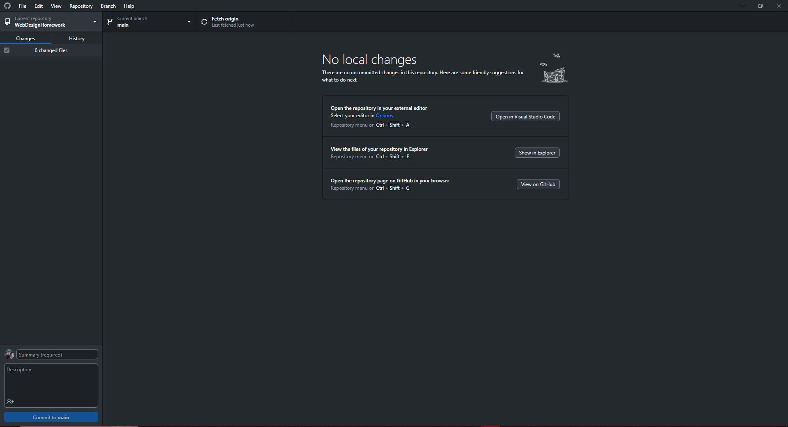

# Assignment 5
Here I am showing a few different things about HTML.

I am recycling parts of an older project for Intro to Web Development that can be found on my [github](https://github.com/LukeLeimbach/eportfolio/tree/main). This project was made using a BootStrap template along with all the style elements that come with it. I don't use this ePortfolio anymore, so it is currently *very* out of date with my current skill set.

## Cool stuff in here
- Custom horizontal rule
- Relative links to parts inside index.html
- Relative links to other pages (in the navbar)
- Absolute header that dynamically changes as you scroll down
- Link to my GitHub

## Github Desktop

